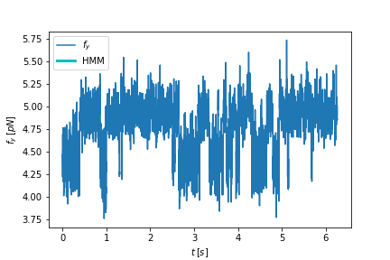

# Hopping Measurements

This thesis work is based on single molecule experiments, performed by hopping measurements via Optical Tweezers at the _University of Padua_.

Optical Tweezers are an amazing tool which uses light to manipulate biomolecule such as DNA _hairpins_ or proteins; using two counterpropagating laser beams it is possible to trap these molecules and to perform _hopping_ experiments, i.e. to observe the biosensor passing throug its equilibrium configurations.

## Hidden Markov Model

For a DNA _hairpin_, two are the main states of equilibrium, which are the _native_ state (folded configuration) and the _unfolded_ one. In order to find the hidden configurations, an _hidden Markov model_ (HMM) is performed.

The 3 problems in HMM Δ are:

* evaluation problem: how to calculate the probability P(O|Δ) of the observation sequence, indicating how much the HMM Δ parameters affects the sequence O;
* uncovering problem: how to find the sequence of states X ={x_1, x_2, ....., x_T} so that it is more likely to produce the observation sequence O;
* learning problem: how to adjust parameters of Δ such as initial state distribution $\Pi$, transition probability matrix $A$ and observation probability matrix $B$.

To solve these problems, 3 algorithm have been introduced: **Forward-backward algorithm, Viterbi algorithm and Expectation Maximization (EM) algortihm** (also known as Baum-Welch algorithm).

The picture illustrates the 2-hidden states in an _hopping_ plot.
